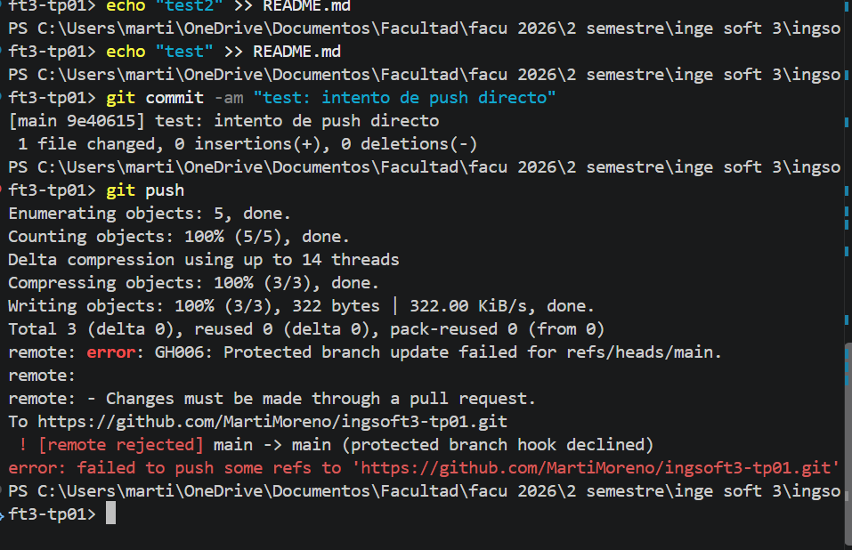
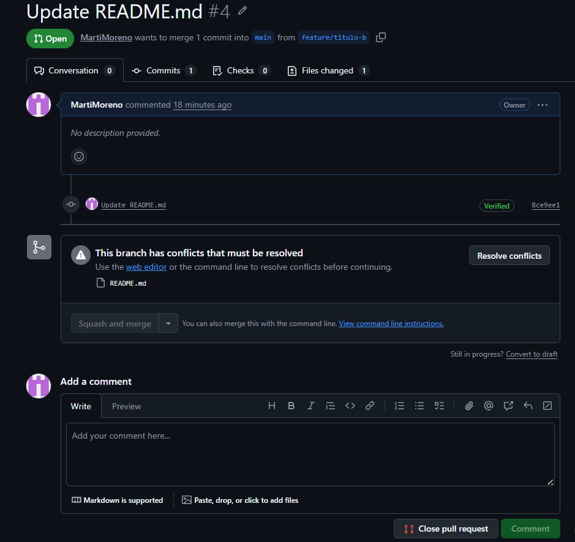
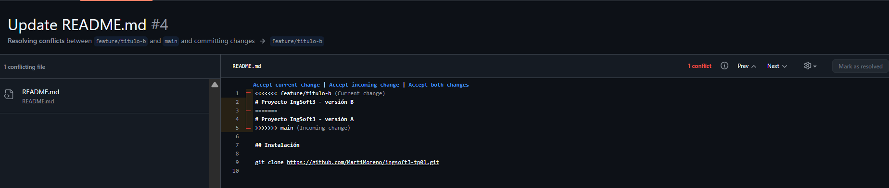
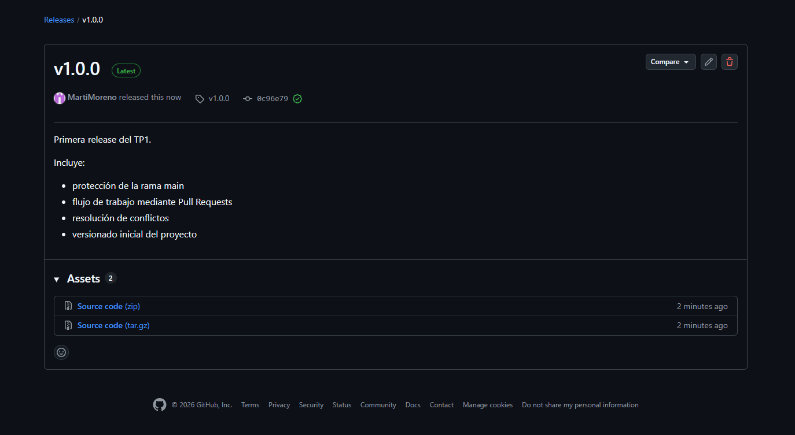

# Evidencias — TP1

## 1. Push directo a main rechazado

GitHub rechaza el push directo a `main` porque la rama está protegida y los cambios deben realizarse mediante un Pull Request.

## 2. El PR de la rama B no se puede mergear: conflicto

El Pull Request de la rama `feature/titulo-b` no se puede mergear automáticamente porque presenta un conflicto con `main`.

## 3. Marcadores del conflicto

GitHub muestra los marcadores del conflicto entre las versiones A y B del título del `README.md`.

## 4. Release v1.0.0 publicada

La release `v1.0.0` fue publicada como primera versión estable del TP.