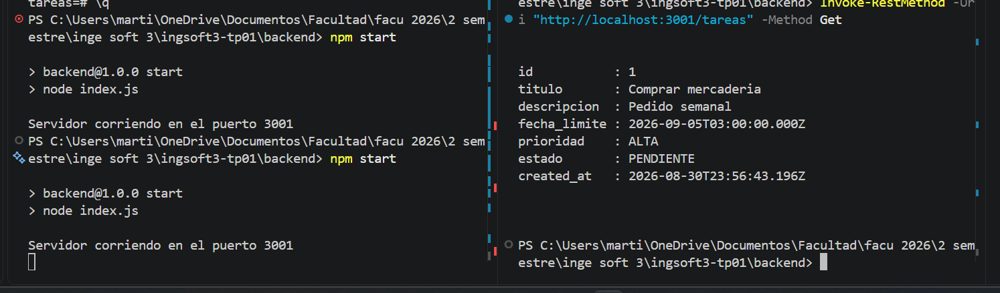
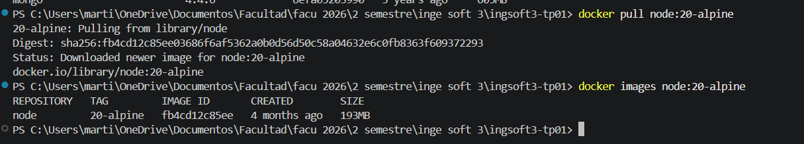
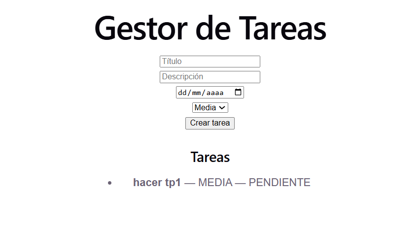
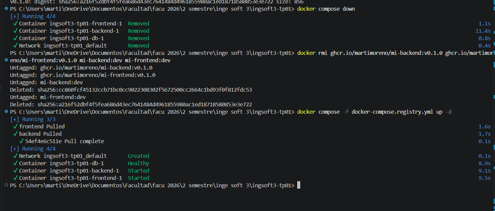

# Evidencias — TP1

## 1. Push directo a main rechazado

GitHub rechaza el push directo a `main` porque la rama está protegida y los cambios deben realizarse mediante un Pull Request.

## 2. El PR de la rama B no se puede mergear: conflicto

El Pull Request de la rama `feature/titulo-b` no se puede mergear automáticamente porque presenta un conflicto con `main`.

## 3. Marcadores del conflicto

GitHub muestra los marcadores del conflicto entre las versiones A y B del título del `README.md`.

## 4. Release v1.0.0 publicada

La release `v1.0.0` fue publicada como primera versión estable del TP.

## TP2 — Contenedores

### 1. Persistencia sin Docker (backend + PostgreSQL)

Después de reiniciar el proceso de Express (`Ctrl+C` y `npm start` de nuevo), la tarea creada previamente sigue apareciendo — demuestra que los datos viven en PostgreSQL y no en la memoria del backend.

### 2. Comparación de tamaño de imágenes

La imagen final del backend (`mi-backend:dev`, 204MB) pesa apenas 11MB más que la imagen base `node:20-alpine` (193MB), gracias a usar una imagen liviana y `npm ci --omit=dev`.

### 3. Persistencia con Docker Compose

Después de `docker compose down` y `docker compose up -d` (sin `-v`), la tarea sigue existiendo — el volumen `db_data` conserva los datos aunque los contenedores se recreen.

### 4. Imágenes publicadas en el registry

Al levantar el sistema con `docker compose -f docker-compose.registry.yml up -d`, los servicios `frontend` y `backend` se descargan ("Pulled") desde ghcr.io en vez de construirse localmente — confirma que las imágenes están publicadas y son públicas.